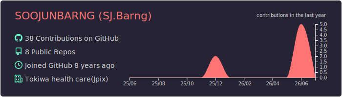
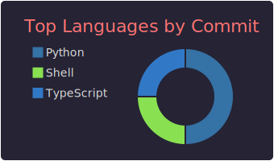
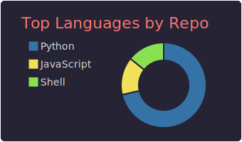
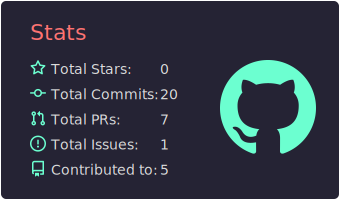
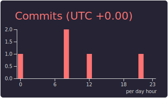

# 🗂️ git_control — SOOJUNBARNG リポジトリ管理

> 最終更新: 2026-07-22 09:19 UTC | 合計: 55件

全リポジトリの一覧・管理スクリプトをまとめたハブリポジトリ。**このREADMEは毎日自動更新されます。**

---

## 📊 GitHub Stats

[](https://git.io/streak-stats)

| Overview | Languages |
|----------|-----------|
|  |  |

| Repos per Language | Stats per Language | Productive Time |
|--------------------|--------------------|-----------------|
|  |  |  |

---

## 使い方

```bash
./scripts/status.sh   # 全リポジトリの状態確認
./scripts/pull_all.sh  # 全リポジトリを最新に更新
./scripts/list.sh      # リポジトリ一覧を表示
```

---

## リポジトリ一覧 (55件)

### 📊 データ・スクレイピング系

| リポジトリ | 公開 | 説明 | 最終更新 | リンク |
|-----------|------|------|----------|--------|
| suumo_rental_scraper_task | 🔒 | This project scrapes rental property listings from [SUUMO](https://suumo.jp/), a major Japanese real estate listing site. It collects bui... | 2026-07-22 | [link](https://github.com/SOOJUNBARNG/suumo_rental_scraper_task) |
| address_geo_visualization_task | 🔒 | 住所をジオコーディングし、周辺の行政区域境界と指定半径を地図上に可視化するツール（folium / kepler.gl） | 2026-07-22 | [link](https://github.com/SOOJUNBARNG/address_geo_visualization_task) |
| speech_to_text_analysis_task | 🔒 | 音声データの文字起こし（Whisper + pyannote話者分離）とテキスト分析（キーワード頻度・ワードクラウド・spaCy/GiNZAによる形態素解析）を行うプロジェクト | 2026-07-22 | [link](https://github.com/SOOJUNBARNG/speech_to_text_analysis_task) |
| data_visualization_task | 🔒 | アソシエーション分析、決定木、地理データマッピング、ネットワークグラフ、サンキーダイアグラム、ウォーターフォールチャートなど、データ可視化・分析手法を試すPythonスクリプト集 | 2026-07-21 | [link](https://github.com/SOOJUNBARNG/data_visualization_task) |
| customer_area_visualization_task | 🔒 | 顧客住所を緯度経度に変換し、埼玉県・東京都エリアでの分布をインタラクティブ地図で可視化するツール | 2026-07-21 | [link](https://github.com/SOOJUNBARNG/customer_area_visualization_task) |

### 👔 鳩ヶ谷系

| リポジトリ | 公開 | 説明 | 最終更新 | リンク |
|-----------|------|------|----------|--------|
| Firebase_Hatogaya_voice_product | 🔒 | 音声を録音・アップロードするだけで、AI（Vertex AI Gemini）が文字起こしと要約まで自動で行う医療現場向け音声記録アプリ。 | 2026-07-22 | [link](https://github.com/SOOJUNBARNG/Firebase_Hatogaya_voice_product) |
| hatogaya_jobhunting | 🔒 | You can check out [the Next.js GitHub repository](https://github.com/vercel/next.js) - your feedback and contributions are welcome! | 2026-07-21 | [link](https://github.com/SOOJUNBARNG/hatogaya_jobhunting) |
| Hatogaya_knowledge_share_web_system | 🔒 | — | 2026-07-18 | [link](https://github.com/SOOJUNBARNG/Hatogaya_knowledge_share_web_system) |
| Hatogaya_talent_management | 🔒 | jinjer × Claude APIで構築した人材管理システム。 | 2026-07-18 | [link](https://github.com/SOOJUNBARNG/Hatogaya_talent_management) |
| Tokiwa-hatogaya-study-app | 🔒 | — | 2026-07-12 | [link](https://github.com/SOOJUNBARNG/Tokiwa-hatogaya-study-app) |
| hatogaya_jotform | 🔒 | — | 2026-02-19 | [link](https://github.com/SOOJUNBARNG/hatogaya_jotform) |

### 🔧 ツール・管理系

| リポジトリ | 公開 | 説明 | 最終更新 | リンク |
|-----------|------|------|----------|--------|
| git_control | 🌐 | SOOJUNBARNG 全リポジトリの一覧・管理ハブ。READMEは毎日自動更新。 | 2026-07-22 | [link](https://github.com/SOOJUNBARNG/git_control) |
| All_general_data_for_barng | 🔒 | 個人資料を整理する個人用アーカイブリポジトリ | 2026-07-21 | [link](https://github.com/SOOJUNBARNG/All_general_data_for_barng) |
| Data_upload_and_download | 🔒 | AWSクラウド移行前にデータをTableauで週次・月次で観測するための臨時ツール。 | 2026-07-18 | [link](https://github.com/SOOJUNBARNG/Data_upload_and_download) |

### 📦 その他

| リポジトリ | 公開 | 説明 | 最終更新 | リンク |
|-----------|------|------|----------|--------|
| unmei48-product | 🔒 | 運命48 — 四柱推命ベースの縁結びアプリ（Flutter + Firebase）。 | 2026-07-22 | [link](https://github.com/SOOJUNBARNG/unmei48-product) |
| image_bg_task | 🌐 | ロゴ・ブランド画像の下処理用ツールキット：背景除去、自動クロップ、ICO/SVG変換 | 2026-07-21 | [link](https://github.com/SOOJUNBARNG/image_bg_task) |
| auto_contact_form_task | 🔒 | AIでお問い合わせフォームを自動検出・入力する営業自動化ツール（Selenium + Claude API） | 2026-07-21 | [link](https://github.com/SOOJUNBARNG/auto_contact_form_task) |
| Google_ads_control | 🔒 | Google Ads API を使い、月間予算目標に合わせてキャンペーン予算を自動調整するPythonスクリプト | 2026-07-20 | [link](https://github.com/SOOJUNBARNG/Google_ads_control) |
| Google_drive_file_directory_change | 🔒 | 個人のGoogle Driveのファイル・フォルダを自動整理するPythonツール（拡張子/キーワード別振り分け、重複検出、リネーム整形、ドライラン対応） | 2026-07-20 | [link](https://github.com/SOOJUNBARNG/Google_drive_file_directory_change) |
| KJM_GAS_electricity_water_result_task | 🔒 | GAS: 電気・水道使用量の集計結果をフロア別PDF化してメール送信。clasp + GitHub Actionsで自動デプロイ | 2026-07-20 | [link](https://github.com/SOOJUNBARNG/KJM_GAS_electricity_water_result_task) |
| GCP_IAM_COST_CONTROL | 🔒 | GCP/Firebaseの支払い状況を項目別に把握し、プロジェクトをローカルGitリポジトリに紐づけて一覧できるダッシュボードツール。 | 2026-07-18 | [link](https://github.com/SOOJUNBARNG/GCP_IAM_COST_CONTROL) |
| qr_make_task | 🌐 | QR code generator and simple Q&A site | 2026-06-29 | [link](https://github.com/SOOJUNBARNG/qr_make_task) |

### 🏥 医療・病院系

| リポジトリ | 公開 | 説明 | 最終更新 | リンク |
|-----------|------|------|----------|--------|
| Hatogaya_shift_automation_app | 🔒 | シフト自動作成システムへの情報入力・管理Webアプリ。希望休・制約をGoogle Sheetsに登録し、OR-Toolsでシフト自動生成。 | 2026-07-22 | [link](https://github.com/SOOJUNBARNG/Hatogaya_shift_automation_app) |
| Jpix_ocr_task | 🔒 | 財務諸表PDFを表抽出/OCRでExcel・Wordに変換するツール(Tkinter GUI + CLIスクリプト) | 2026-07-21 | [link](https://github.com/SOOJUNBARNG/Jpix_ocr_task) |
| THS_dentist_shift_automake_data | 🔒 | 以上が要件の整理内容です。必要に応じて修正や補足を行います！ | 2026-07-21 | [link](https://github.com/SOOJUNBARNG/THS_dentist_shift_automake_data) |
| Medical_frontier_code | 🔒 | これは房の個人レポジトリーではあるが、すべて会社の資産であり個人での利用を厳禁する。 | 2026-07-18 | [link](https://github.com/SOOJUNBARNG/Medical_frontier_code) |
| saitama-hospital-info-collector | 🔒 | 埼玉県の在宅療養支援診療所・病院データをJMAPから収集し、Gemini APIで要約・特徴タグ付けするパイプライン。 | 2026-07-18 | [link](https://github.com/SOOJUNBARNG/saitama-hospital-info-collector) |
| Scrap_medical_job_detail_task | 🔒 | 医療系求人サイトjob-medley.comから求人データをスクレイピングし、Excelに整形するパイプライン。 | 2026-07-18 | [link](https://github.com/SOOJUNBARNG/Scrap_medical_job_detail_task) |
| Hospital_display_video | 🔒 | 診察の呼出し状況をリアルタイム表示する、病院向け受付・サイネージシステム。 | 2026-07-18 | [link](https://github.com/SOOJUNBARNG/Hospital_display_video) |
| Hatogaya-medical-chat-bot | 🌐 | — | 2026-07-12 | [link](https://github.com/SOOJUNBARNG/Hatogaya-medical-chat-bot) |

### 🏬 その他法人・外部案件

| リポジトリ | 公開 | 説明 | 最終更新 | リンク |
|-----------|------|------|----------|--------|
| YRC-shukatsu-lab | 🔒 | 外資・日系就活支援Webアプリ｜記事・企業検索・AIエントリシート添削・選考管理 | Firebase + Gemini 2.5 Flash | 2026-07-21 | [link](https://github.com/SOOJUNBARNG/YRC-shukatsu-lab) |
| MA_Techno | 🔒 | 企業リストのスクレイピングを支援するスクリプト集 | 2026-07-21 | [link](https://github.com/SOOJUNBARNG/MA_Techno) |
| Job_quit | 🔒 | 給与・勤務状況・生年月日・住所などの人事データから従業員の退職リスクをRandomForest+SHAPで予測し、 | 2026-07-18 | [link](https://github.com/SOOJUNBARNG/Job_quit) |
| negishi_survey | 🔒 | Firebase Hosting上で公開する、利用者・ご家族向けの満足度調査フォーム。 | 2026-07-18 | [link](https://github.com/SOOJUNBARNG/negishi_survey) |
| azuma-jotform | 🔒 | Firebase Hosting上で公開している、患者向けの満足度調査フォーム。 | 2026-07-18 | [link](https://github.com/SOOJUNBARNG/azuma-jotform) |
| Ser_inc_HP | 🔒 | Corporate website for SER Inc. — a Tokyo-based bridge between Korean tech/culture and the Japanese market. | 2026-07-18 | [link](https://github.com/SOOJUNBARNG/Ser_inc_HP) |
| Sake_selling_ecshop | 🔒 | 韓国語話者向けの日本酒販売ECサイト（React + Vite + Firebase）。 | 2026-07-18 | [link](https://github.com/SOOJUNBARNG/Sake_selling_ecshop) |

### 🤖 AI・自動化系

| リポジトリ | 公開 | 説明 | 最終更新 | リンク |
|-----------|------|------|----------|--------|
| google-maps-route-optimizer | 🔒 | Google Maps Routes APIを使った複数経由地ルート最適化ツール（CSV/Googleスプレッドシート対応、Leaflet地図出力） | 2026-07-21 | [link](https://github.com/SOOJUNBARNG/google-maps-route-optimizer) |
| ai_diary_app | 🔒 | samples, guidance on mobile development, and a full API reference. | 2026-07-21 | [link](https://github.com/SOOJUNBARNG/ai_diary_app) |
| AI_Voice_bot_netlify | 🔒 | User -> Node.js (このコード) -> Dialogflow CX (Intent) -> 固定の回答 | 2026-07-18 | [link](https://github.com/SOOJUNBARNG/AI_Voice_bot_netlify) |
| Auto-translation-task | 🔒 | 日本語ファイル（PowerPoint / Word / Excel）を Gemini API で自動翻訳するツール。 | 2026-07-18 | [link](https://github.com/SOOJUNBARNG/Auto-translation-task) |
| PPTAgent_barng | 🌐 | PPTAgent: Generating and Evaluating Presentations Beyond Text-to-Slides | 2025-03-20 | [link](https://github.com/SOOJUNBARNG/PPTAgent_barng) |
| nanobrowser | 🌐 | Open-source Chrome extension for AI-powered web automation. Run multi-agent workflows using your own LLM API key. Alternative to OpenAI Operator. | 2025-03-12 | [link](https://github.com/SOOJUNBARNG/nanobrowser) |
| novel-writer-korean | 🌐 | Automated LLM novelist | 2025-03-10 | [link](https://github.com/SOOJUNBARNG/novel-writer-korean) |

### 👤 個人・キャリア系

| リポジトリ | 公開 | 説明 | 最終更新 | リンク |
|-----------|------|------|----------|--------|
| barng-career-site | 🔒 | Soojun Barng's multilingual career/resume site with a Tokiwa Health OKR reporting integration | 2026-07-21 | [link](https://github.com/SOOJUNBARNG/barng-career-site) |

### 🏢 クリニック・法人HP系

| リポジトリ | 公開 | 説明 | 最終更新 | リンク |
|-----------|------|------|----------|--------|
| Negishi_homecare_HP | 🔒 | 空室状況（getVacancy） | 2026-07-21 | [link](https://github.com/SOOJUNBARNG/Negishi_homecare_HP) |
| azuma-visit-clinic-hp | 🔒 | microCMS Templates | 2026-07-17 | [link](https://github.com/SOOJUNBARNG/azuma-visit-clinic-hp) |
| Tokiwa-healthcare-service | 🔒 | microCMS Templates | 2026-01-12 | [link](https://github.com/SOOJUNBARNG/Tokiwa-healthcare-service) |

### 💰 財務・経理系

| リポジトリ | 公開 | 説明 | 最終更新 | リンク |
|-----------|------|------|----------|--------|
| Financial_evaluation_task_tool | 🔒 | PL/BSベースの企業財務評価を行うためのツール群。 | 2026-07-21 | [link](https://github.com/SOOJUNBARNG/Financial_evaluation_task_tool) |
| Data_for_receipt | 🔒 | レセプト（診療報酬明細書）データを処理するパイプラインと、閲覧用Streamlitダッシュボード（旧receipt_data_hatogayaを統合） | 2026-07-21 | [link](https://github.com/SOOJUNBARNG/Data_for_receipt) |
| Barng_financial_projects | 🌐 | This is a proof of concept for an AI-powered hedge fund (educational purposes only). | 2026-07-18 | [link](https://github.com/SOOJUNBARNG/Barng_financial_projects) |
| StockSharp_barng | 🌐 | Algorithmic trading and quantitative trading open source platform to develop trading robots (stock markets, forex, crypto, bitcoins, and options). | 2025-03-13 | [link](https://github.com/SOOJUNBARNG/StockSharp_barng) |

### 💬 LINE・通知系

| リポジトリ | 公開 | 説明 | 最終更新 | リンク |
|-----------|------|------|----------|--------|
| LINE_WORKS_SUMMARY | 🔒 | LINE WORKSのトーク履歴をGemini APIで要約し、指定チャンネルに投稿するツール。 | 2026-07-18 | [link](https://github.com/SOOJUNBARNG/LINE_WORKS_SUMMARY) |
| LINE_TASK_CONTROL | 🔒 | LINE WORKS APIでユーザー一覧取得・タスク作成・一括登録を行うスクリプト集。 | 2026-07-18 | [link](https://github.com/SOOJUNBARNG/LINE_TASK_CONTROL) |
| LINE_LINEWORKS_GAS_SERVER_AI_CHATSERVICE | 🔒 | LINEとLINE WORKSの両方に対応したAIチャットサービス。 | 2026-07-18 | [link](https://github.com/SOOJUNBARNG/LINE_LINEWORKS_GAS_SERVER_AI_CHATSERVICE) |

---

🔒 = プライベート　🌐 = パブリック
